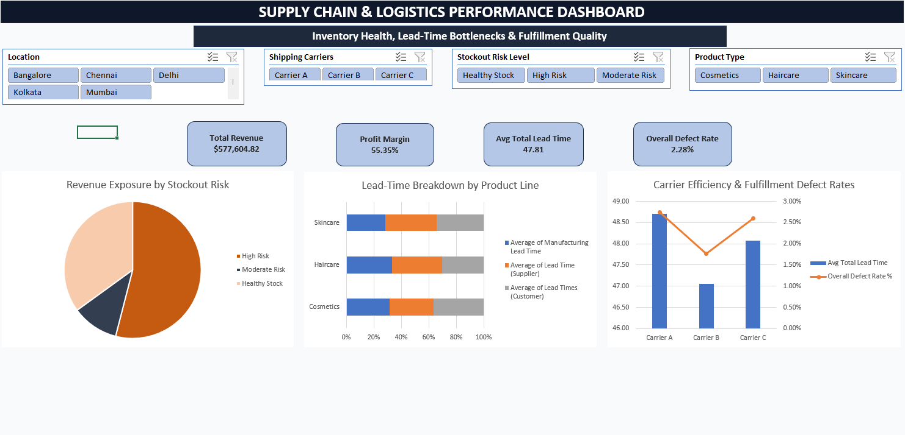

# Supply Chain & Logistics Performance Analytics

An interactive Excel analytics dashboard evaluating end-to-end supply chain efficiency, inventory stockout risk exposure, lead-time bottlenecks, and carrier fulfillment quality.



---

## Executive Summary
This project analyzes operational supply chain performance across product categories, fulfillment nodes, and shipping carriers. Raw transactional data was ingested, cleaned, and structured using **Power Query**, modeled into a star-schema architecture using **Power Pivot**, and analyzed using custom **DAX measures**.

---

## Key Performance Indicators (KPIs)
* **Total Revenue:** $577,604.82 across all fulfillment nodes
* **Profit Margin:** **55.35%** (accounting for unit manufacturing and shipping costs)
* **Average Lead Time:** **47.81 days** across production, supplier fulfillment, and final customer delivery
* **Overall Defect Rate:** **2.28%** maintaining quality standards across carrier networks

---

## Technical Architecture & DAX Measures

### Data Cleaning & Modeling (Power Query)
* **Header Standardization:** Transformed raw fields into standardized, capitalized schema (`supply_chain_data`).
* **Stockout Risk Segmentation:** Created conditional logic for `Stockout Risk Level` to categorize inventory status (*High Risk*, *Moderate Risk*, *Healthy Stock*).

### DAX Calculations
```dax
// Financial Metrics
Total Revenue := SUM(supply_chain_data[Revenue Generated])

Total Cost := 
    SUMX(supply_chain_data, supply_chain_data[Manufacturing Costs] * supply_chain_data[Order Quantities]) 
  + SUMX(supply_chain_data, supply_chain_data[Shipping Costs] * supply_chain_data[Order Quantities])

Total Profit := [Total Revenue] - [Total Cost]

Profit Margin % := DIVIDE([Total Profit], [Total Revenue], 0)

// Operational Quality Metrics
Overall Defect Rate % := AVERAGE(supply_chain_data[Defect Rates]) / 100
```
---
## Dashboard Visualizations
Revenue Exposure by Stockout Risk (Donut Chart): Pinpoints total sales volume tied up in high-risk SKUs to proactively manage inventory replenishment.

Lead-Time Breakdown by Product Line (100% Stacked Bar Chart): Compares manufacturing, supplier, and customer delivery lag across Cosmetics, Haircare, and Skincare lines.

Carrier Efficiency vs. Quality Matrix (Combo Chart): Evaluates shipping carrier reliability by plotting average transit days alongside defect percentages.

Interactive Slicers: Synchronized cross-filtering across Location, Shipping Carrier, Stockout Risk Level, and Product Type.
